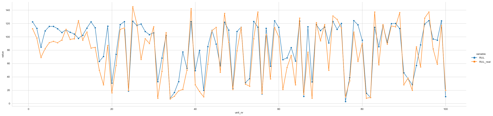
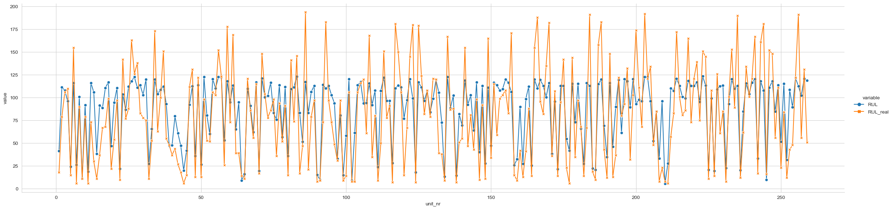
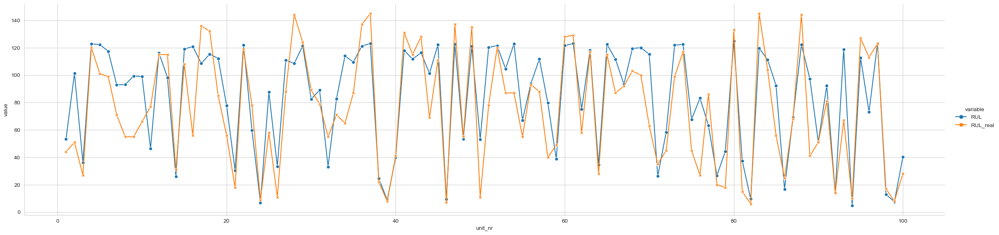
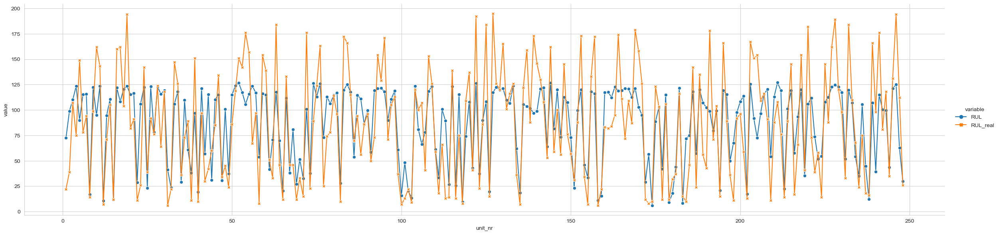
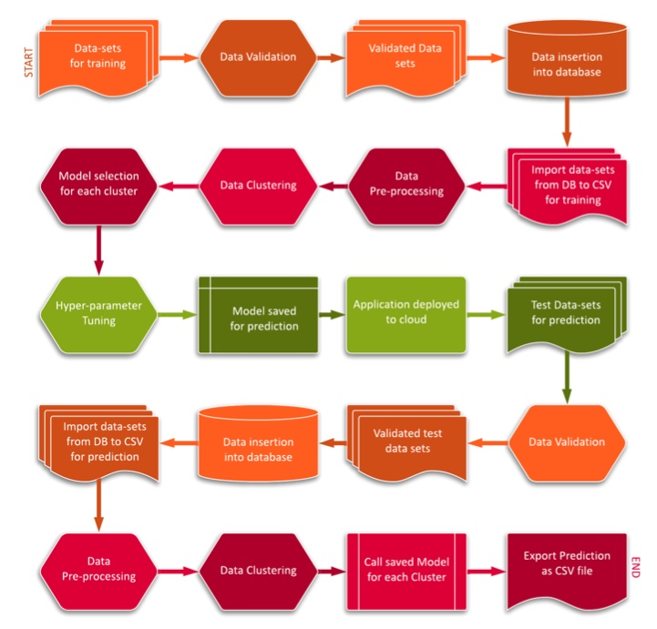

# Data-Science-project-Aerospace-engineering

The solution proposed here is a Remaining Useful Life(RUL) detection system, which selects a suitable machine-learning algorithm based on the characteristics of input data set to model degradation of the Turbo jet engine. The predicted RUL can then be used to estimate the heath of the engine and to decide if maintenance or replacement is needed.

The predictor page is deployed in cloud at ([Heroku-steamlit](https://rul-predictor.herokuapp.com/))

>Predict from stock files

>Check download prediction files

>Prediction files will be downloaded to your system

>If you don't recieve the files, cassandra db might be in hibernation.

## Overview
### Data

The original dataset is from 
([Kaggle-nasa turbofan degradation model](https://www.kaggle.com/code/sanchitapaul/nasa-turbofan-degradation-model/data)), 
and I've downloaded it.
You can find it in folder /CMaps.

The training data consists of several data sets, each consisting of multiple mul- tivariate time series, where a unit of time is a cycle of operation of the engine. Each time series in the set corresponds to a different engine, hence the data can be considered to be from a fleet of similar engines. Each engine starts with a different initial condition including manufacturing flaws, variations. As the time series progresses, the engine develops a fault which leads to its breakdown.

The data sets include three operational settings and data from 21 sensors, all columns in the data set indicate different variables as shown :

1. Unit number of engine.
2. Time in cycles of operation.
3. Operational setting 1
4. Operational setting 2
5. Operational setting 3
6. Sensor 1
7. Sensor 2 ...
26. Sensor 21

### Results

Use the trained model to find RUL of four test files, the result is statisfactory.

>In the image x-axis corresponds to individual turbojet engines and y-axis corresponds to its remaining useful life(RUL).

>Real remaining useful life(RUL) in orange which we got from kaggle is compared to predicted remaining useful life(RUL) in blue. 

Suggestion for further improvements:

>Neural networks, more complex models can be utilised. It will take up significant resource for implemention.

### Run

Python 3.9 was used.

Put correct prediction files for prediction at Prediction_Batch_files

Run main.py. 
5001 is default local server. 

>On local UI/Browser Input filepath: Prediction_Batch_files

>On Postman use: {"filepath":"Prediction_Batch_files"} for prediction and {"filepath":"Training_Batch_Files"} for training

Files would be saved in Prediction_output file

### Architechture

### Data Validation

Along with the data sets a schema file is also required, which is used for data validation. Schema is a .json file that contains all the necessary metadata about the training data sets - file names, column names, number of columns, datatype of columns. This file is checked against the training data for its validation. 

The process follows the following steps :

>Name validation: The schema file contains the specifications for file name, a regex pattern is created according to this specification and the filename of training data sets is matched against the pattern, If a match is found, the corresponding data set is moved to Good data folder otherwise it is moved to Bad data folder.

>Column name Similarly, the name of the columns in the data sets should match with the specification present in the schema files. Accordingly the file is put into Good data folder or Bad data folder.

### Data Insertion into Cassandra db

After the training data is validated, it has to be stored in a database. 

This is achieved following the steps listed below :

>Connect to DB system Establish connect to the database system which might be a server running locally or a cloud DB system, depending upon the de- velopers. In our implementation we will be using DataStax Astra DB system which uses Apache Cassandra database.

>Create database and connect A database is created on Astra DB and a connection is established to the database.

>Create data table In the database, multiple tables are created, the schema of the tables i.e., field names, data types are inferred from the schema file. If old tables are already present containing previously imported training data, they are not replaced or modified, instead new table are created. So that the models can learn from old as well as new data.

>Data insertion: The validated training data files are present in Good data folder, the data from these files is uploaded to the appropriate tables. Since different data sets correspond to different type of training data, multi- ple columns are mandatory and the data sets should not be combined together. If importing a file leads to an error because of the file type (column mismatch, datatype mismatch etc.) the same file is moved to Bad data folder.

### Export from Cassandra db to CSV

Exporting data fromDB: The training data sets are present as tables in the database. These tables are exported to a .csv (comma separated values) file, that is used for training.

### Data pre processing

Data pre-processing In this step, the csv files are loaded into pandas DataFrame objects, and the data is cleaned and modified. This involves following sub steps :
7

> All sensor data columns are checked for standard deviation, if any of them has zero standard deviation, it’s deleted from the data set as it does not provide any useful information.

> If any sensor data columns contain NULL or missing entries, these are imputed using KNN (k nearest neighbors) Imputer.

### Data Clustering

Data Clustering: Pre-processed data is fed into K-means algorithm to create clusters, the reason behind clustering is to implement different algorithms for the clusters. K-means model is trained over pre-processed data and the model is saved for later predictions. The Elbow plot of the data is used to find the optimal number of clusters, this is achieved dynamically using Knee-locator function.

### Model selection for each cluster

Model can be found in tuner.py file, Xgboost and Random forest are used. 

>The best model for each cluster is selected based on best parameters model Hyerparameter tuning.

>For each algorithm the parameters are calculated using GridSearch, thereafter the R2 scores are evaluated for each of the models and the one with the best score is selected. All models selected using this procedure are saved for predictions.

### Model Saved for prediction

Here application could be deployed to the cloud.

### Test data set validation

Along with the test data, a schema file is required. Schema lists the rele- vant metadata about data-sets - file names, column names, number of columns, datatype of columns. The validation process is exactly similar to that in the training case 3.2.1.

>Name validation: The schema file contains the specifications for file name, a regex pattern is created according to this specification and the filename of training data sets is matched against the pattern, If a match is found, the corresponding data set is moved to Good data folder otherwise it is moved to Bad data folder.

>Column name Similarly, the name of the columns in the data sets should match with the specification present in the schema files. Accordingly the file is put into Good data folder or Bad data folder.

>Number of columns: The schema specifies the permissible number of columns present in the data set, the files that validate against schema are moved to Good data folder and otherwise to Bad data folder.

>Column datatype: The datatype of each column should be the same as that specified in the schema file, following which the data is put in Good data folder and failing which it is put in Bad data folder.

### Test data Insertion into Cassandra db

Connect to DB system Establish connect to the database system which might be a server running locally or a cloud DB system, depending upon the de- velopers. In our implementation we will be using DataStax Astra DB system which uses Apache Cassandra database.

>Create database and connect A database is created on Astra DB and a connection is established to the database.

>Create data table In the database, multiple tables are created, the schema of the tables i.e., field names, data types are inferred from the schema file. If old tables are already present containing previously imported training data, they are not replaced or modified, instead new table are created. So that the models can learn from old as well as new data.

>Data insertion: The validated training data files are present in Good data folder, the data from these files is uploaded to the appropriate tables. Since different data sets correspond to different type of training data, multiple columns are mandatory and the data sets should not be combined together. If importing a file leads to an error because of the file type (column mismatch, datatype mismatch etc.) the same file is moved to Bad data folder.

### Import from Cassandra db to CSV

Exporting data fromDB The training data sets are present as tables in the database. These tables are exported to a .csv (comma separated values) file.

### Data pre processing

Data pre-processing In this step, the csv files are loaded into pandas DataFrame objects, and the data is cleaned and modified. This involves following sub steps :

> All sensor data columns are checked for standard deviation, if any of them has zero standard deviation, it’s deleted from the data set as it does not provide any useful information.

> If any sensor data columns contain NULL or missing entries, these are imputed using KNN (k nearest neighbors) Imputer.

### Data Clustering

Data Clustering: The K-means model trained during the clustering of training data is loaded. This model is used to predict clusters of the pre-processed test data sets.

### Call saved model for each cluster

RUL prediction: After data is clustered, each cluster is loaded and based on its cluster number, a corresponding ML model is loaded, this model was saved during the training phase. The model is used to predict remaining useful life RUL for all data points in the cluster.

### Export prediction file for each CSV

After the predictions are done for all clusters, RUL along with engine number are written to a csv file. This file is then exported to Astra DB.
